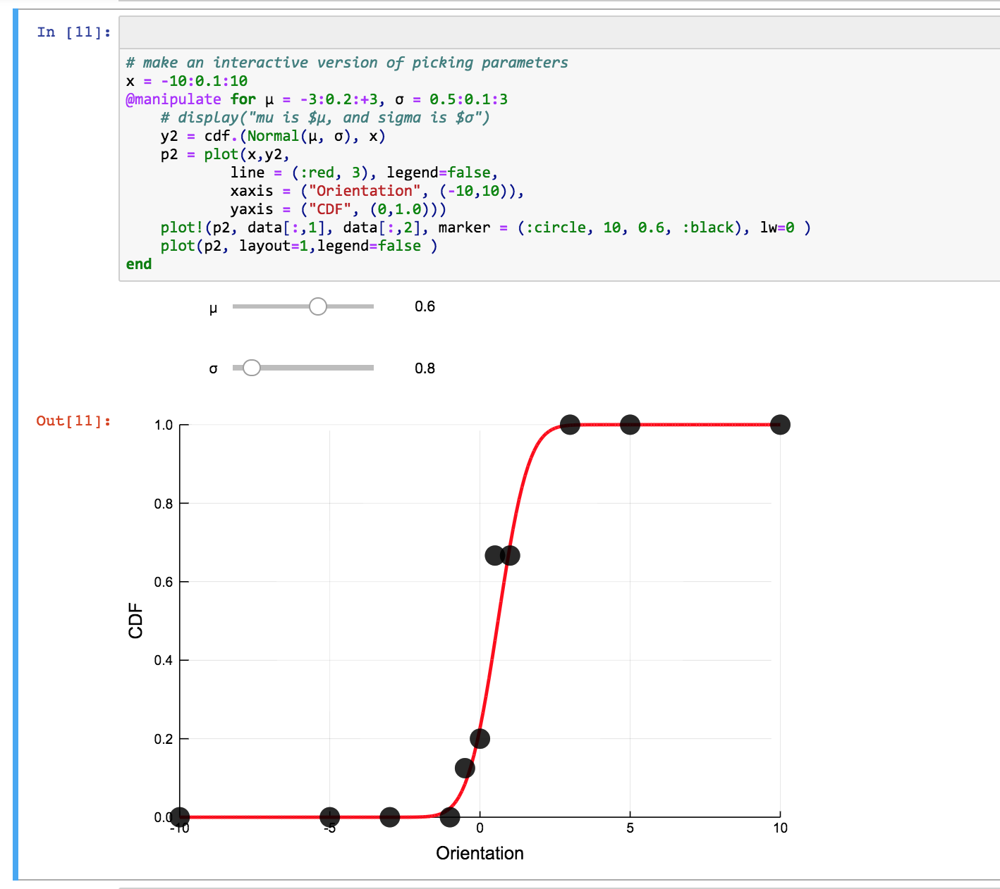

# Interactive example psychometric curves

How do the parameters μ and σ affect the shape of a psychometric curve we want to fit.

Simple jupyter notebook running some ``julia`` code.

ds - 2017-12-14
